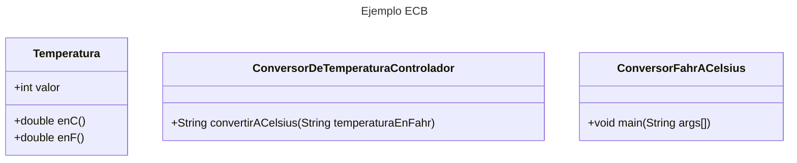
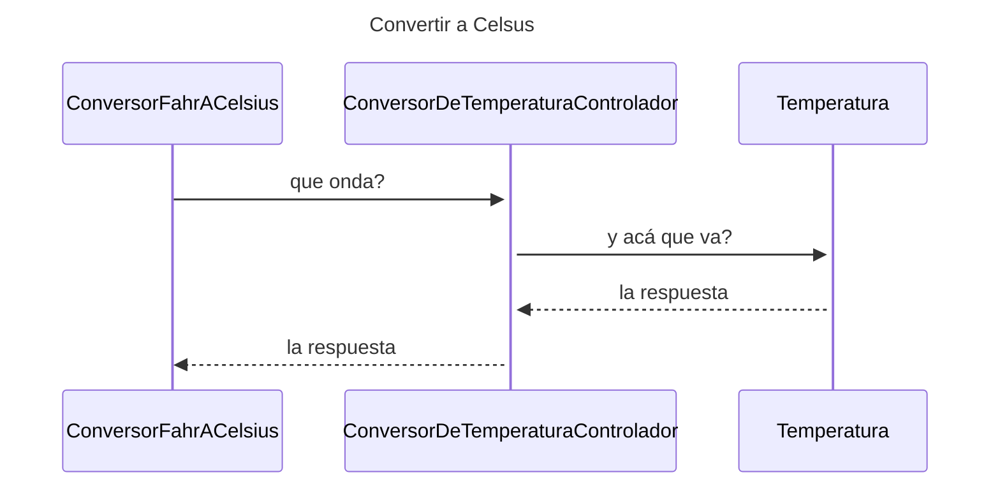

# Conversor de temperatura de Fahr a Celsius

Proyecto de ejemplo para aplicar alguna de las ideas vistas en clase de constructores, encapsulamiento, variables de instancia y método de instancia y clases.

## ¿Qué necesito?

- java jdk 21
- un IDE como intellij community o visual studio code con el plugin de java

## ¿Cómo lo buildeo?

Puedo usar la herramienta o desde el directorio src.

```bash
javac programa/ConversorFahrACelsius.java
```

Luego corremos lo corremos con:

```bash
java programa.ConversorFahrACelsius 32 68 95
```

Esto debe imprimir:

```json
32 F son 0 ºC
68 F son 20 ºC
95 F spm 35 ºC
```

## Explicación

El programa sigue el patrón BCE -> Boundary, Controller y Entity como vimos en clase.

El Boundary es la clase que contiene el main y que recorre los parámetros y para cada uno llama al controlador para calcular e imprimir el valor correspondiente.

El controlador recibe un string y me devuelve un string para imprimir en la interfaz. En este caso la consola.

El entity es un objeto que representa una temperatura.

## Tarea

1. Completar el código para que corra como se indica más arriba.
2. ¿Se puede encapsular el entity?
3. La fórmula que convierte un Farenheit a Celsius es (Tf-32)*9/5. ¿Cómo sería hacer la inversa?
4. ¿Cuáles son métodos estáticos y para que se usan?
5. ¿Y cuáles son constructores y dónde se usan?
6. Completar el diagrama de clases.
7. Completar el diagrama de secuencia.
8. ¿Cómo crearíamos un programa que pase de Celsius a Fahr?

## Diagrama de Clases



## Diagrama de Secuencia




## Documentación

https://mermaid.js.org/syntax/sequenceDiagram.html
https://mermaid.js.org/syntax/classDiagram.html

